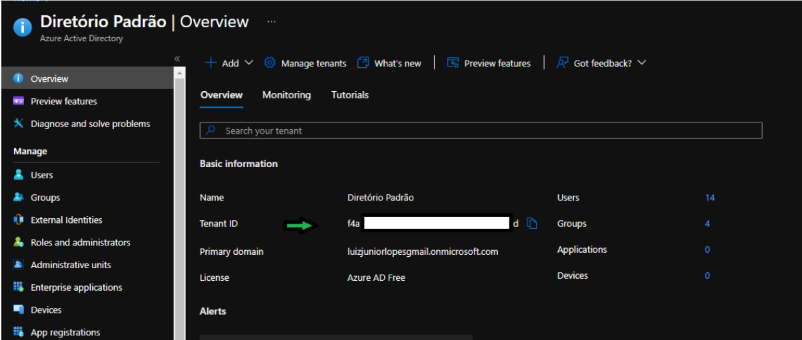

# Lab 1.1 - Criação de usuários membros e convidados em massa usando o powershell

## Instalando PowerShell para Azure AD no PC Local

### Abra o powershell como administrador

Execute o comando a seguir:


 **powershell** 
  ```powershell
   Install-Module AzureAD
   ```

### Conectando ao Azure AD pelo powershell

Execute o comando a seguir:


 **powershell** 
  ```powershell
   Connect-AzureAD -TenantID <digite o ID do tenant>
   ```
 **Exemplo** 
  ```powershell
   Connect-AzureAD -TenantID 11a11a11-1aa1-a11a-11a1-1111a1111a11
   ```

**Obs:** O valor do Tenant ID é encontrado dentro do seu diretório do Azure AD no portal. Se não colocar o tenant ID pode ocorrer erro de autorização na hora de executar os cmdlets.




### Criando usuário membro em massa com o PowerShell

No seu computador local crie uma pasta no diretório C: chamada “work”.


Crie um arquivo na plataforma que quiser em forma de planilha e a configure como a imagem abaixo:


Edite os campos com as informações dos usuários que irão ser criados. Edite o nome do arquivo como na figura acima(esse nome pode ser qualquer um de sua escolha). Após os campos preenchidos, baixe o arquivo no formato .csv e insira o arquivo na pasta “work” criada anteriormente.


Volte ao powershell.


Execute o comando a seguir:


 **powershell** 
  ```powershell
   #Insere o caminho do seu .csv para uma variável. Verifique se o caminho está igual ao seu, caso não esteja coloque o caminho correto do seu arquivo.
   $CsvFilePath = "C:\work\bulkMemberUsers.csv"

   #Importa o csv
   $NewUsers = import-csv -Path $CsvFilePath

   #insere o primary domain do seu diretório para uma variável. Edite esse campo com o seu.
   $directory = "contoso.com"

   # O comando “Foreach” irá passar por todos os usuários do seu csv, para que possam ser criados.
   Foreach ($NewUser in $NewUsers) { 

      $PasswordProfile = New-Object -TypeName Microsoft.Open.AzureAD.Model.PasswordProfile

      $PasswordProfile.Password = $NewUser.passwordProfile

      #A variável abaixo irá compor as informações do “UserPrincipalName”
      $UPN = $NewUser.firstName + "." + $NewUser.lastName + "@" + $directory

      $DisplayName = $NewUser.firstName + " " + $NewUser.lastName + " (" + $NewUser.department + ")"

      $MailNickName = $NewUser.firstName + "." + $NewUser.lastName


      New-AzureADUser -UserPrincipalName $UPN -AccountEnabled $true -DisplayName $DisplayName `
      -GivenName $NewUser.FirstName -MailNickName $MailNickName -Surname $NewUser.LastName `
      -Department $Newuser.Department -JobTitle $NewUser.jobTitle -PasswordProfile $PasswordProfile


    }

   ```

**Obs:** Após a execução bem-sucedida desse script, os novos usuários serão criados em seu Azure Active Directory. Uma vez que especificamos -AccountEnabled = $True, os novos usuários podem usar imediatamente sua senha para entrar no diretório. Se você não quiser que as contas de usuários fiquem ativas diretamente após a execução do script, especifique -AccountEnabled = $False e habilite as contas posteriormente usando o cmdlet Set-AzureADUser.


### Criando usuário convidado em massa com o PowerShell


Execute o comando a seguir:


 **powershell** 
  ```powershell
  $invitedUserEmailAddress = "someexternaluser@externaldomain.com"
  $inviteRedirectUrl = "http://myapps.microsoft.com"

  New-AzureADMSInvitation -InvitedUserEmailAddress $invitedUserEmailAddress `
  -SendInvitationMessage $True -InviteRedirectUrl $inviteRedirectUrl
   ```


**Saída** 
  ```saida
  
Id                      : 6058156a-93d1-4958-a738-ddc4ab4432cf
InvitedUserDisplayName  :
InvitedUserEmailAddress : someexternaluser@externaldomain.com
SendInvitationMessage   : True
InviteRedeemUrl         : https://login.microsoftonline.com/redeem?rd=https%3a%2f%2finvitations.microsoft.com%2fredeem%2f%3ftenant%3d06f6521d-c18c-460a-8656-fa82e81aa94b%26user%3d7b67d069-163b-4f7e-9118-c9ceeda363d9%26ticket%3ddANXuWQMNhYv21%252bFBm%252fULkTqCnpX6vNvRgTHQmsECPU%253d%26ver%3d2.0
InviteRedirectUrl       : http://myapps.microsoft.com/
InvitedUser             : class User {
                            Id: 04fd8318-77ca-428e-b7f2-2bb1ef7a0100
                            OdataType:
                          }

InvitedUserMessageInfo  : class InvitedUserMessageInfo {
                            CcRecipients: System.Collections.Generic.List`1[Microsoft.Open.MSGraph.Model.Recipient]
                            CustomizedMessageBody:
                            MessageLanguage:
                          }

InvitedUserType         : Guest
Status                  : PendingAcceptance


   ```

### Criando grupo no AAD com o PowerShell

Execute o comando a seguir:


 **powershell** 
  ```powershell
  $displayName = "My new group"
  $mailNickName = "NotSet"
  $description = "Novo Grupo criado"

  New-AzureADGroup -DisplayName $displayName `
  -Description $description -MailEnabled $false `
  -SecurityEnabled $true -MailNickName $mailNickName
   ```

 **Saída** 
  ```saida
  ObjectId                             DisplayName  Description
  --------                             -----------  -----------
  11fa5e1e-737c-40c5-835e-416ae3959606 My new group Novo Grupo criado
   ```

   ### Adicionar a um membro uma função do Active Directory

Para adicionar uma função a um usuário no AAD é necessário o ID de uma função habilitada no diretório e o ID do usuário.
É importante no momento da atribuição da função ao usuário utilizar o id de função já habilitada. Para verificar as funções habilitadas em seu diretório use o comando abaixo.


Execute o comando a seguir:


 **powershell** 
  ```powershell
   Get-AzureADDirectoryRole
   ```

Esse comando lista todas as funções já habilitadas em seu diretório. Caso seja necessário uma função que não está entre as habilitadas, procure ela entre os templates para habilita-la. Para verificar os templates de funções existentes, use o comando abaixo.

Execute o comando a seguir:


 **powershell** 
  ```powershell
   Get-AzureADDirectoryRoleTemplate
   ```

Esse comando lista uma série de templates de funções que podem ser utilizadas. Caso encontre entres eles a função desejada, habilite-a para que possa usá-la para atribuir posteriormente a um usuário. Guarde o valor do “DisplayName” da função desejada e a habilite com os comandos abaixo.

**Obs:** O valor do Tenant ID é encontrado dentro do seu diretório do Azure AD no portal. Se não colocar o tenant ID pode ocorrer erro de autorização na hora de executar os cmdlets.

Execute o comando a seguir:


 **powershell** 
  ```powershell
   # Preenchendo a variável com os dados do template da função requerida. 

   $InviterRole = Get-AzureADDirectoryRoleTemplate | Where-Object {$_.DisplayName -eq "Guest Inviter"}

   # Verificando se a variável $InviterRole possui o template da função correta.

   $InviterRole

   ```

 **Saída** 
  ```saida
   ObjectId |                           DisplayName     Description
   --------                             -----------     ----------------------------------
   95e79109-95c0-4d8e-aee3-d01accf2d47b Guest Inviter   Guest Inviter has access to invite guest users.
                                                                                           
   ```

   **powershell** 
  ```powershell
   # Habilitando a função Guest Inviter
   Enable-AzureADDirectoryRole -RoleTemplateId $InviterRole.ObjectId

   ```

   
 **Saída** 
  ```saida
   ObjectId |                           DisplayName     Description
   --------                             -----------     ----------------------------------
   03618579-3c16-4765-9539-86d9163ee3d9 Guest Inviter   Guest Inviter has access to invite guest users.
                                                                                           
   ```
**Obs:** Note que "ObjetctID" do template e da função habilitada são diferentes.

Uma vez que o usuário está criado e a função que será atribuída está habilitada, vamos assinalar a função ao usuário.

Execute o comando a seguir:


 **powershell** 
  ```powershell
  #Exemplo id da Função Habilitada do AAD
   $objectId = "e500186d-ea0b-4337-9ead-f3417d8fad36"
   #Exemplo id do usuário do AAD
   $refObjectId = "3ca06235-6ac9-4c1a-b00f-7c3d4bc0dc18"

   Add-AzureADDirectoryRoleMember -ObjectId $objectId -RefObjectId $refObjectId
   ```

### Adicionar a um grupo uma função do Active Directory

Para adicionar funções a grupos é necessário pré-requisito.

Pré-requisito
+ Licença Azure AD Premium P1 ou P2 para cada administrador de unidade administrativa

Para assinalar uma função a um grupo existente, execute o comando a seguir:

 **powershell** 
  ```powershell
  #Nesse exemplo inserimos os dados de um grupo com um “DisplayName” com a string “Suporte” para obter o ID desse grupo.

   $groupID = Get-AzureADGroup -SearchString "Suporte"

   #Adquire o ID da função
   $roleDefinition = Get-AzureADMSRoleDefinition -Filter "displayName eq 'User Administrator'"

   #Adiciona a função “User administrator” ao grupo Suporte
   New-AzureADMSRoleAssignment -DirectoryScopeId '/' -RoleDefinitionId $roleDefinition.Id -PrincipalId $group.Id
   ```

Para assinalar uma função a um grupo novo, execute o comando a seguir:

 **powershell** 
  ```powershell
  #cria um novo grupo e posteriormente será usado para obter o ID desse grupo.

   $group = New-AzureADMSGroup -DisplayName "Contoso_Helpdesk_Administrators" -Description "This group is assigned to Helpdesk Administrator built-in role in Azure AD." -MailEnabled $false -SecurityEnabled $true -MailNickName "contosohelpdeskadministrators" -IsAssignableToRole $true

   #Adquire o ID da função
   $roleDefinition = Get-AzureADMSRoleDefinition -Filter "displayName eq 'User Administrator'"

   #Adquire o ID da função
   New-AzureADMSRoleAssignment -DirectoryScopeId '/' -RoleDefinitionId $roleDefinition.Id -PrincipalId $group.Id
   ```
   Após esses comandos o grupo terá as permissões dadas pela atribuição da função.

#### Revisão

Nesse laboratório, você aprendeu:

+ Instalando Módulo PowerShell Azure AD no PC Local
+ Conectando ao Azure AD pelo powershell
+ Criar usuário membro da sua organização com o PowerShell
+ Criar usuário convidado com o PowerShell
+ Criar grupo no Azure AD com o PowerShell
+ Adicionar um membro a um grupo do Azure AD
+ Adicionar uma função a um usuário do Azure AD
+ Adicionar uma função a um grupo do Azure AD


#### Referências

+ https://docs.microsoft.com/en-us/powershell/module/azuread/new-azureadgroup?view=azureadps-2.0
+ https://docs.microsoft.com/en-us/powershell/module/azuread/enable-azureaddirectoryrole?view=azureadps-2.0
+ https://docs.microsoft.com/en-us/powershell/module/azuread/add-azureaddirectoryrolemember?view=azureadps-2.0
+ https://docs.microsoft.com/en-us/powershell/module/azuread/new-azureadmsgroup?view=azureadps-2.0
+ https://docs.microsoft.com/pt-br/azure/active-directory/roles/groups-assign-role
