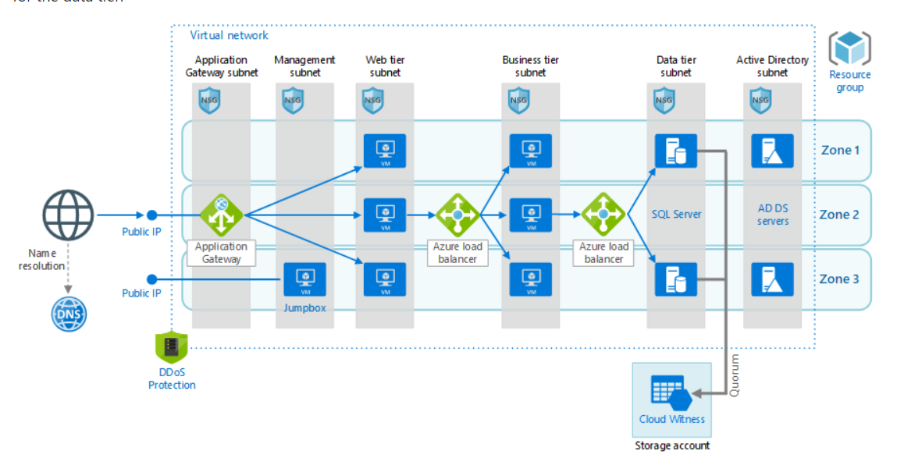

# Lab 1 - N-tier_application_with_SQL_Server




## Roteiro

+ Criar resource group
+ Criar Vnet e a subnet do Application Gateway 
+ Criar demais Subnets
+ Criar NSG's
+ Criando regras para os NSG's
+ Associar os NSG's às subnets.
+ Criar Bastion Host
+ Criar Máquinas Virtuais da camada Web
+ Criar Application Gateway
+ Criar Máquinas Virtuais da camada Business
+ Criar Azure Load Balancer da camada Business
+ Criar uma regra de saída no NSG da camada web direcionado o trafego para o loadbalancer da camada Business.
+ Criar conta de armazenamento para Máquinas Virtuais da camada de  Banco de Dados
+ Criar Máquinas Virtuais da camada de  Banco de Dados
+ Associar o armazenamento às maquinas da camada de Banco de Dados
+ Criar Azure Load Balancer da camada de dados
+ Criar uma regra de saída no NSG da camada Business direcionado o trafego para o loadbalancer da camada de  Banco de Dados.
+ Criar DNS Público
+ Criar DDos
+ Deletar recursos do Lab


## Abra o cloud shell no portal do Azure

Primeiramente faça login em sua conta do Microsoft Azure. Em seguida abra o cloud Shell.

**Obs:** Nesse laboratório usaremos comandos em cli e powershel, então utilize o cloud shell com o powershell.


## Criar resource group
Execute o comando a seguir:


 **Cloud Shell** 
  ```
   $name = "rg-ntier"
   $location = "westus"

   az group create --name $name --location $location

   ```


## Criar Vnet e a subnet do Application Gateway.

Execute o comando a seguir:


 **Cloud Shell**  
  ```
   $resourceGroup = "rg-ntier"
   $location = "westus"
   $vNetName = "vnet-ntier"
   $addressPrefixVNet="10.5.0.0/16"
   $subnetNameApg = "subnet-apg"
   $subnetPrefixApg = "10.5.0.0/24"

   echo "Creating vNet and subnetNameApg"
   az network vnet create --resource-group $resourceGroup `
   --name $vNetName --address-prefix $addressPrefixVNet `
   --location "$location" --subnet-name $subnetNameApg `
   --subnet-prefix $subnetPrefixApg

   ```

## Criando demais subnets

### Criando subnet de gerenciamento 
Execute o comando a seguir:


 **Cloud Shell**  
  ```
   $resourceGroup = "rg-ntier"
   $vNetName = "vnet-ntier"
   $subnetBastionName = "AzureBastionSubnet"
   $subnetPrefixBastion = "10.5.254.0/27"

   echo "Creating subnet BastionHost"
   az network vnet subnet create --address-prefix $subnetPrefixBastion --name $subnetBastionName --resource-group $resourceGroup --vnet-name $vNetName

   ```

### Criando subnet Web 
Execute o comando a seguir:


 **Cloud Shell**  
  ```
   $resourceGroup = "rg-ntier"
   $vNetName = "vnet-ntier"
   $subnetWebName = "subnet-web"
   $subnetPrefixWeb = "10.5.1.0/24"

   echo "Creating subnet Web"
   az network vnet subnet create --address-prefix $subnetPrefixWeb --name $subnetWebName --resource-group $resourceGroup --vnet-name $vNetName

   ```


### Criando subnet Business 
Execute o comando a seguir:


 **Cloud Shell**  
  ```
   $resourceGroup = "rg-ntier"
   $vNetName = "vnet-ntier"
   $subnetBusinessName = "subnet-business"
   $subnetPrefixBusiness = "10.5.2.0/24"

   echo "Creating subnet Bussiness"
   az network vnet subnet create --address-prefix $subnetPrefixBusiness --name $subnetBusinessName --resource-group $resourceGroup --vnet-name $vNetName

   ```

### Criando subnet Data 
Execute o comando a seguir:


 **Cloud Shell**  
  ```
   $resourceGroup = "rg-ntier"
   $vNetName = "vnet-ntier"
   $subnetDataName = "subnet-data"
   $subnetPrefixData = "10.5.3.0/24"

   echo "Creating subnet data"
   az network vnet subnet create --address-prefix $subnetPrefixData --name $subnetDataName --resource-group $resourceGroup --vnet-name $vNetName

   ```


### Criando subnet Active Directory 
Execute o comando a seguir:


 **Cloud Shell**  
  ```
   $resourceGroup = "rg-ntier"
   $vNetName = "vnet-ntier"
   $subnetAdName = "subnet-ad"
   $subnetPrefixAd = "10.5.4.0/24"

   echo "Creating subnet AD"
   az network vnet subnet create --address-prefix $subnetPrefixAd --name $subnetAdName --resource-group $resourceGroup --vnet-name $vNetName

   ```

## Criar NSG's

Execute o comando a seguir:


 **Cloud Shell**  
  ```
   $resourceGroup = "rg-ntier"
   $location = "westus"
   
   echo "Creating nsg's"
   az network nsg create --resource-group $resourceGroup --name "nsgApg" --location "$location"
   az network nsg create --resource-group $resourceGroup --name "nsgWeb" --location "$location"
   az network nsg create --resource-group $resourceGroup --name "nsgBusiness" --location "$location"
   az network nsg create --resource-group $resourceGroup --name "nsgData" --location "$location"
   az network nsg create --resource-group $resourceGroup --name "nsgAD" --location "$location"

   ```

## Criando regras para os NSG's

**Cloud Shell**  
  ```
   $resourceGroup = "rg-ntier"
   $location = "westus"
   
   echo "Criando regras para nsgApg"
   az network nsg rule create --resource-group $resourceGroup --nsg-name "nsgApg" --name Allow-HTTP --access Allow --protocol Tcp --direction Inbound --priority 100 --source-address-prefix Internet --source-port-range "*" --destination-address-prefix "*" --destination-port-range 80

   az network nsg rule create --resource-group $resourceGroup --nsg-name "nsgApg" --name Gateway --access Allow --protocol Tcp --direction Inbound --priority 101 --source-address-prefix GatewayManager --source-port-range "*" --destination-address-prefix "*" --destination-port-range 65200-65535

    echo "Criando regras para nsgWeb"

      az network nsg rule create --resource-group $resourceGroup --nsg-name "nsgWeb" --name AllowBastion --access Allow --protocol Tcp --direction Inbound --priority 110 --source-address-prefix "10.5.254.0/27" --source-port-range "*" --destination-address-prefix "*" --destination-port-range 3389


   echo "Criando regras para nsgBusiness"

   az network nsg rule create --resource-group $resourceGroup --nsg-name "nsgBusiness" --name AllowBastion --access Allow --protocol Tcp --direction Inbound --priority 110 --source-address-prefix "10.5.254.0/27" --source-port-range "*" --destination-address-prefix "*" --destination-port-range 3389

   az network nsg rule create --resource-group $resourceGroup --nsg-name "nsgBusiness" --name AllowBusiness --access Allow --protocol Tcp --direction Inbound --priority 100 --source-address-prefix "10.5.1.0/24" --source-port-range "*" --destination-address-prefix "10.5.2.0/24" --destination-port-range 80

  

   echo "Criando regras para nsgData"

   az network nsg rule create --resource-group $resourceGroup --nsg-name "nsgData" --name AllowRDP --access Allow --protocol Tcp --direction Inbound --priority 1000 --source-address-prefix "10.5.4.0/24" --source-port-range "*" --destination-address-prefix "10.5.3.0/24" --destination-port-range 3389

   az network nsg rule create --resource-group $resourceGroup --nsg-name "nsgData" --name MSSQLRule --access Allow --protocol Tcp --direction Inbound --priority 1001 --source-address-prefix "10.5.2.0/24" --source-port-range "*" --destination-address-prefix "*" --destination-port-range 1433

   
   ```

## Associar os NSG's às subnets.

Execute o comando a seguir:


 **Cloud Shell**  
  ```
   $resourceGroup = "rg-ntier"
   $location = "westus"
   $vNetName = "vnet-ntier"
   $subnetNameApg = "subnet-apg"
   $subnetWebName = "subnet-web"
   $subnetBusinessName = "subnet-business"
   $subnetDataName = "subnet-data"
   $subnetAdName = "subnet-ad"
   $nsgApg = "nsgApg"
   $nsgWeb = "nsgWeb"
   $nsgBusiness = "nsgBusiness"
   $nsgData = "nsgData"
   $nsgAd = "nsgAD"
   
   echo "Associando nsgApg ao subnetNameApg"
   az network vnet subnet update --vnet-name $vNetName --name $subnetNameApg --resource-group $resourceGroup --network-security-group $nsgApg
  
   echo "Associando nsgWeb ao subnetWebName"
   az network vnet subnet update --vnet-name $vNetName --name $subnetWebName --resource-group $resourceGroup --network-security-group $nsgWeb
  
   echo "Associando nsgBusiness ao subnetBusinessName"
   az network vnet subnet update --vnet-name $vNetName --name $subnetBusinessName --resource-group $resourceGroup --network-security-group $nsgBusiness

   echo "Associando nsgData ao subnetDataName"
   az network vnet subnet update --vnet-name $vNetName --name $subnetDataName --resource-group $resourceGroup --network-security-group $nsgData

   echo "Associate nsgAd ao subnetAdName"
   az network vnet subnet update --vnet-name $vNetName --name $subnetAdName --resource-group $resourceGroup --network-security-group $nsgAd


   ```


## Criar bastion host

**Cloud Shell**  
  ```
   $resourceGroup = "rg-ntier"
   $location = "westus"
   $vNetName = "vnet-ntier"
   $publicIpBastionName = "publicIpBastion"
   $bastionName = "bastionNTier"

   az network public-ip create --resource-group $resourceGroup --name $publicIpBastionName  --sku Standard --location $location

   az network bastion create --name $bastionName --public-ip-address $publicIpBastionName --resource-group $resourceGroup --vnet-name $vNetName --location $location
   ```


## Criar máquinas virtuais da camada web

   **Cloud Shell**  
   ```
   for ($i = 1; $i -lt 4 ; $i++)
   {
      $resourceGroup = "rg-ntier"
      $vNetName = "vnet-ntier"
      $subnetWebName = "subnet-web"
      $nsg = "nsgWeb"
      $vmWebName = "vmWebNTier$i"
      $image = "Win2019datacenter"
      $login = "azureUser"
      $senha = "P4ss0w0rd555*"
      
   
      az vm create `
      --name $vmWebName `
      --resource-group $resourceGroup `
      --admin-password $senha `
      --admin-username $login `
      --image $image `
      --no-wait `
      --vnet-name $vNetName `
      --subnet $subnetWebName `
      --nsg $nsg `
      --public-ip-address """"
   }  
   ```

   Após a criação das vms, inserir comando abaixo em cada vm pelo Run comand no portal e desligar e ligar vm's novamente.


      powershell.exe Install-WindowsFeature -name Web-Server -IncludeManagementTools
      powershell.exe Remove-Item -Path 'C:\inetpub\wwwroot\iisstart.htm'
      powershell.exe Add-Content -Path 'C:\inetpub\wwwroot\iisstart.htm' -Value $($env:computername)

## Criar Application Gateway

   Primeiramente vamos obter o ip's das máquinas da camada web para associa-lo ao application gateway

   **Cloud Shell**  
   ``` 
      $resourceGroup = "rg-ntier"
      $vm1WebName = "vmWebNTier1"
      $vm2WebName = "vmWebNTier2"
      $vm3WebName = "vmWebNTier3"

      az vm list-ip-addresses -g $resourceGroup -n $vm1WebName
      az vm list-ip-addresses -g $resourceGroup -n $vm2WebName
      az vm list-ip-addresses -g $resourceGroup -n $vm3WebName
   ```

   Agora vamos implatar o Application Gateway

   **Cloud Shell**  
   ```
   $resourceGroup = "rg-ntier"
   $location = "westus"
   $vNetName = "vnet-ntier"
   $subnetNameApg = "subnet-apg"
   $publicIpApgName = "publicIpApg"
   $apgName = "apgNTier"
   # "Coloque os valores do ip's privados das VM's web"
   $ipVMWeb1 = "10.5.1.4"
   $ipVMWeb2 = "10.5.1.5"
   $ipVMWeb3 = "10.5.1.6"

   az network public-ip create --resource-group $resourceGroup --name $publicIpApgName --sku Basic --location $location

   az network application-gateway create -g $resourceGroup -n $apgName --capacity 3 `
   --sku Standard_Medium --vnet-name $vNetName --subnet $subnetNameApg `
   --http-settings-cookie-based-affinity Disabled `
   --public-ip-address $publicIpApgName --servers $ipVMWeb1 $ipVMWeb2 $ipVMWeb3 

   ```
## Criar DNS Público

## Criar DDos


## Criar Azure Load Balancer da camada Business

### Criar o recurso do balanceador de carga

   Crie um balanceador de carga interno com **az network lb create.**

   **Cloud Shell**  
 ``` 
   $resourceGroup = "rg-ntier"
   $vNetName = "vnet-ntier"
   $subnetBusinessName = "subnet-business"
   $lbName = "lbBusiness"
   $frontendIpName = "frontEndBusiness"
   $backendPoolName = "backEndPoolBusiness"
   
   az network lb create `
   --resource-group $resourceGroup `
   --name $lbName `
   --sku Standard `
   --vnet-name $vNetName `
   --subnet $subnetBusinessName `
   --frontend-ip-name $frontendIpName `
   --backend-pool-name $backendPoolName
  
 ```

### Criar a investigação de integridade

   Uma investigação de integridade verifica todas as instâncias da máquina virtual para garantir que elas possam enviar tráfego de rede.

   Uma máquina virtual com uma verificação de investigação com falha é removida do balanceador de carga. A máquina virtual será adicionada novamente ao balanceador de carga quando a falha for resolvida.

   Crie uma investigação de integridade com **az network lb probe create.**

**Cloud Shell**  
   ``` 
   $resourceGroup = "rg-ntier"
   $vNetName = "vnet-ntier"
   $subnetBusinessName = "subnet-business"
   $lbName = "lbBusiness"
   $probeLbBusinessName = "healthProbeBusiness"
   
   az network lb probe create `
   --resource-group $resourceGroup `
   --lb-name $lbName `
   --name $probeLbBusinessName `
   --protocol tcp `
   --port 80
   ```

### Criar uma regra de balanceador de carga

   Uma regra de balanceador de carga define:
   + A configuração do IP de front-end para o tráfego de entrada
   + O pool de IPs de back-end para receber o tráfego
   + As portas de origem e de destino necessárias

   Crie uma regra de balanceador de carga com az network lb rule create.

   **Cloud Shell**  
 ``` 
   $resourceGroup = "rg-ntier"
   $vNetName = "vnet-ntier"
   $subnetBusinessName = "subnet-business"
   $lbName = "lbBusiness"
   $frontendIpName = "frontEndBusiness"
   $backendPoolName = "backEndPoolBusiness"
   $probeLbBusinessName = "healthProbeBusiness"
   $ruleLbBusinessName= "httpRuleBusiness"

   
   az network lb rule create `
   --resource-group $resourceGroup `
   --lb-name $lbName `
   --name $ruleLbBusinessName `
   --protocol tcp `
   --frontend-port 80 `
   --backend-port 80 `
   --frontend-ip-name $frontendIpName `
   --backend-pool-name $backendPoolName `
   --probe-name $probeLbBusinessName `
   --idle-timeout 15 `
   --enable-tcp-reset true
   ```


### Criar máquinas virtuais da camada Business

**Obs:** O nome da sua maquina virtual não pode ter mais de 15 caracteres.

   **Cloud Shell**  
   ```

   for ($i = 1; $i -lt 4 ; $i++)
   {
      $resourceGroup = "rg-ntier"
      $vNetName = "vnet-ntier"
      $subnetBusinessName = "subnet-business"
      $nsg = "nsgBusiness"
      $vmBusinessName = "vmBusiNTier$i"
      $image = "Win2019datacenter"
      $login = "azureUser"
      $senha = "P4ss0w0rd555*"
      
   
      az vm create `
      --name $vmBusinessName `
      --resource-group $resourceGroup `
      --admin-password $senha `
      --admin-username $login `
      --image $image `
      --no-wait `
      --vnet-name $vNetName `
      --subnet $subnetBusinessName `
      --nsg $nsg `
      --public-ip-address """"
   }

 ```

   Após a criação das vms, inserir comando abaixo em cada vm pelo Run comand no portal e desligar e ligar vm's novamente.

   powershell.exe Install-WindowsFeature -name Web-Server -IncludeManagementTools
   powershell.exe Remove-Item -Path 'C:\inetpub\wwwroot\iisstart.htm'
   powershell.exe Add-Content -Path 'C:\inetpub\wwwroot\iisstart.htm' -Value $($env:computername)

### Adicionar máquinas virtuais ao pool de back-end

   Adicione as máquinas virtuais ao pool de back-end com **az network nic ip-config address-pool add.**

   **Obs:** O **--ip-config-name** é a junção do radical **ipconfig** com o nome de cada vm.

   **Cloud Shell**  

   ``` 
   for ($i = 1; $i -lt 4 ; $i++)
   {
      $resourceGroup = "rg-ntier"
      $lbName = "lbBusiness"
      $backendPoolName = "backEndPoolBusiness"
      $nicName = "vmBusNTier"+$i+"VMNic"
      $ipConfigName = "ipconfigvmBusNTier$i"
   

      az network nic ip-config address-pool add `
      --address-pool $backendPoolName `
      --ip-config-name $ipConfigName `
      --nic-name $nicName `
      --resource-group $resourceGroup `
      --lb-name $lbName
   }
         
   ```
### Criar uma regra de saída no NSG da camada web direcionado o trafego para o loadbalancer da camada Business.

Obtendo o ip do Load Balancer da camada Business

**Cloud Shell**  
  ```
  $resourceGroup = "rg-ntier"
  $lbName = "lbBusiness"
 
  az network lb frontend-ip list -g $resourceGroup --lb-name $lbName
   ```

Criando regra de saída

**Cloud Shell**  
  ```
$resourceGroup = "rg-ntier"
$location = "westus"
$ipFrontLbBusiness = "10.5.2.7"
   
   
echo "Criando regras para nsgWeb"

az network nsg rule create --resource-group $resourceGroup --nsg-name "nsgWeb" --name lbBusiness --access Allow --protocol Tcp --direction Outbound --priority 120 --source-address-prefix "*" --source-port-range "*" --destination-address-prefix "$ipFrontLbBusiness" --destination-port-range 80

   
   ```


## Criar Azure Load Balancer da camada de Banco de dados

### Criar o recurso do balanceador de carga

   Crie um balanceador de carga interno com **az network lb create.**

   **Cloud Shell**  
 ``` 
   $resourceGroup = "rg-ntier"
   $vNetName = "vnet-ntier"
   $subnetDataName = "subnet-data"
   $lbName = "lbData"
   $frontendIpName = "frontEndData"
   $backendPoolName = "backEndPoolData"
   
   az network lb create `
   --resource-group $resourceGroup `
   --name $lbName `
   --sku Standard `
   --vnet-name $vNetName `
   --subnet $subnetDataName `
   --frontend-ip-name $frontendIpName `
   --backend-pool-name $backendPoolName
  
 ```

### Criar a investigação de integridade

   Uma investigação de integridade verifica todas as instâncias da máquina virtual para garantir que elas possam enviar tráfego de rede.

   Uma máquina virtual com uma verificação de investigação com falha é removida do balanceador de carga. A máquina virtual será adicionada novamente ao balanceador de carga quando a falha for resolvida.

   Crie uma investigação de integridade com **az network lb probe create.**

**Cloud Shell**  
   ``` 
   $resourceGroup = "rg-ntier"
   $vNetName = "vnet-ntier"
   $subnetDataName = "subnet-data"
   $lbName = "lbData"
   $probeLbDataName = "healthProbeData"
   
   az network lb probe create `
   --resource-group $resourceGroup `
   --lb-name $lbName `
   --name $probeLbDataName `
   --protocol tcp `
   --port 80
   ```

### Criar uma regra de balanceador de carga

   Uma regra de balanceador de carga define:
   + A configuração do IP de front-end para o tráfego de entrada
   + O pool de IPs de back-end para receber o tráfego
   + As portas de origem e de destino necessárias

   Crie uma regra de balanceador de carga com az network lb rule create.

   **Cloud Shell**  
 ``` 
   $resourceGroup = "rg-ntier"
   $vNetName = "vnet-ntier"
   $subnetDataName = "subnet-data"
   $lbName = "lbBusiness"
   $frontendIpName = "frontEndData"
   $backendPoolName = "backEndPoolData"
   $probeLbBusinessName = "healthProbeData"
   $ruleLbBusinessName= "httpRuleData"

   
   az network lb rule create `
   --resource-group $resourceGroup `
   --lb-name $lbName `
   --name $ruleLbBusinessName `
   --protocol tcp `
   --frontend-port 80 `
   --backend-port 80 `
   --frontend-ip-name $frontendIpName `
   --backend-pool-name $backendPoolName `
   --probe-name $probeLbBusinessName `
   --idle-timeout 15 `
   --enable-tcp-reset true
   ```


EM REVISÃO

### Criar Máquinas Virtuais da camada de Banco de Dados com uma conta de armazenamento

**Obs:** O nome da sua maquina virtual não pode ter mais de 15 caracteres.

**Cloud Shell**  
   ```powershell

      ## Global
      $Location = "westus"
      $resourceGroup = "rg-ntier"

      # Storage
      $StorageName = "rgntierstoragelab"
      $StorageSku = "Premium_LRS"
      $StorageAccount = New-AzStorageAccount -ResourceGroupName $resourceGroup -Name $StorageName -SkuName $StorageSku -Kind "Storage" -Location $Location
   
   for ($i = 1; $i -lt 3 ; $i++)
   {
      
      
           
      ## Network
      
      $InterfaceName = "vmDataNTier"+ $i + "ServerNIC"
      $Nsg = Get-AzNetworkSecurityGroup -Name "nsgData" -ResourceGroupName $resourceGroup
      $vnet = Get-AzVirtualNetwork -Name "vnet-ntier" -ResourceGroupName $resourceGroup
      $Subnet = Get-AzVirtualNetworkSubnetConfig -Name "subnet-data" -VirtualNetwork $vnet  
      $Interface = New-AzNetworkInterface -Name $InterfaceName -ResourceGroupName $resourceGroup -Location $Location -SubnetId $Subnet.Id  -NetworkSecurityGroupId $Nsg.Id


      ##Image
      $PublisherName = "MicrosoftSQLServer"
      $OfferName = "SQL2017-WS2016"
      $Sku = "SQLDEV"
      $Version = "latest"

      ##Compute
      $vmDataName = "vmDataNTier$i"
      $ComputerName = $resourceGroup + "Server"
      $VMSize = "Standard_DS13_v2"
      $OSDiskName = $vmDataName + "OSDisk"
      $VirtualMachine = New-AzVMConfig -VMName $vmDataName -VMSize $VMSize
      $Credential = Get-Credential -Message "Type the name and password of the local administrator account."
      $VirtualMachine = Set-AzVMOperatingSystem -VM $VirtualMachine -Windows -ComputerName $ComputerName -Credential $Credential -ProvisionVMAgent -EnableAutoUpdate #-TimeZone = $TimeZone
      $VirtualMachine = Add-AzVMNetworkInterface -VM $VirtualMachine -Id $Interface.Id
      $OSDiskUri = $StorageAccount.PrimaryEndpoints.Blob.ToString() + "vhds/" + $OSDiskName + ".vhd"
      $VirtualMachine = Set-AzVMOSDisk -VM $VirtualMachine -Name $OSDiskName -VhdUri $OSDiskUri -Caching ReadOnly -CreateOption FromImage

      # Create the VM in Azure
      New-AzVM -ResourceGroupName $resourceGroup -Location $Location -VM $VirtualMachine

      # Add the SQL IaaS Extension, and choose the license type
      New-AzSqlVM -ResourceGroupName $resourceGroup -Name $VirtualMachine -Location $Location -LicenseType PAYG
   }
   ```

### Adicionar máquinas virtuais ao pool de back-end

   Adicione as máquinas virtuais ao pool de back-end com **az network nic ip-config address-pool add.**

   **Obs:** O **--ip-config-name** é a junção do radical **ipconfig** com o nome de cada vm.

   **Cloud Shell**  

   ``` 
   for ($i = 1; $i -lt 4 ; $i++)
   {
      $resourceGroup = "rg-ntier"
      $lbName = "lbData"
      $backendPoolName = "backEndPoolData"
      $nicName = "vmDataNTier"+$i+"Nic"
      $ipConfigName = "ipconfigvmDataNTier$i"
   

      az network nic ip-config address-pool add `
      --address-pool $backendPoolName `
      --ip-config-name $ipConfigName `
      --nic-name $nicName `
      --resource-group $resourceGroup `
      --lb-name $lbName
   }
         
   ```
### Criar uma regra de saída no NSG da camada web direcionado o trafego para o loadbalancer da camada Business.

Obtendo o ip do Load Balancer da camada de Banco de Dados

**Cloud Shell**  
  ```
  $resourceGroup = "rg-ntier"
  $lbName = "lbData"
 
  az network lb frontend-ip list -g $resourceGroup --lb-name $lbName
   ```

Criando regra de saída

**Cloud Shell** 
  ```
$resourceGroup = "rg-ntier"
$location = "westus"
$ipFrontLbData = "10.5.3.6"
   
   
echo "Criando regras para nsgBusiness"

az network nsg rule create --resource-group $resourceGroup --nsg-name "nsgBusiness" --name lbData --access Allow --protocol Tcp --direction Outbound --priority 120 --source-address-prefix "*" --source-port-range "*" --destination-address-prefix "$ipFrontLbBusiness" --destination-port-range 1443

   
   ```

## Deletar recursos

Para deletar o grupo de recurso, execute o comando abaixo.

  **Cloud Shell** 
  ```
   $name = "rg-ntier"
  
   az group delete --name $name
   ``` 

Quando se deleta o grupo de recursos, todos os recursos contidos nele são deletados. Ao fazer esse processo se certifique que todos o s recursos podem ser excluídos. Caso contrário, exclua-os individualmente.   

#### Referências


