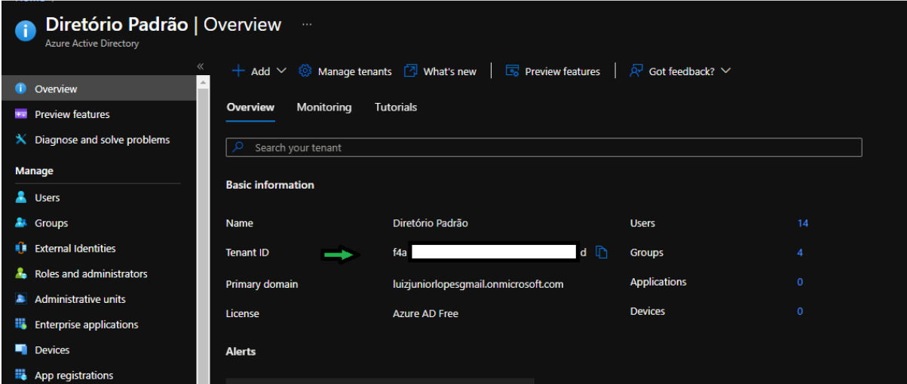

# Lab 1 - N-tier_application_with_SQL_Server Cli do Azure

## Roteiro
+ Instalar Cli do Azure no pc local
+ Criar Vnet
+ Criar Subnets
+ Criar arquivo para instalar servidor NGINX nas máquinas virtuais da camada web
+ Criar Máquinas Virtuais camada Web
+ Criar Application Gateway
+ Criar Bastion Host
+ Criar arquivo para instalar servidor NGINX nas máquinas virtuais da camada de negócios
+ Criar Máquinas Virtuais da camada de negócios
+ Criar Load Balance da camada de negócios
+ Criar conta de armazenamento para Máquinas Virtuais da camada de banco de dados
+ Criar Máquinas Virtuais da camada de banco de dados
+ Criar Load Balance da camada de banco de dados
+ Criar DNS Publico
+ criar DDos
## Instalando Cli do Azure no PC Local a partir do powershell

Você também pode instalar a CLI do Azure usando o PowerShell.

### Abra o powershell como administrador

Execute o comando a seguir:


 **powershell** 
  ```powershell
   $ProgressPreference = 'SilentlyContinue'; Invoke-WebRequest -Uri https://aka.ms/installazurecliwindows -OutFile .\AzureCLI.msi; Start-Process msiexec.exe -Wait -ArgumentList '/I AzureCLI.msi /quiet'; rm .\AzureCLI.msi
   ```

Isso baixará e instalará a versão mais recente da CLI do Azure para Windows. Se você já tiver uma versão instalada, o instalador atualizará a versão existente.

Para instalar uma versão específica, substitua o argumento ```-Uri```  pelo ```https://azcliprod.blob.core.windows.net/msi/azure-cli-<version>.msi```, colocando a versão desejada no campo **\<version>**. As versões disponíveis podem ser encontradas nas [notas de versão da CLI do Azure](https://docs.microsoft.com/en-us/cli/azure/release-notes-azure-cli) .

**Obs:** Para utilizar o módulo do CLI após a instalação, feche e abra novamente o powershell como administrador.


## Faça login pelo CLI

Primeiramente faça login em sua conta.
Você continuará na interface do powershell, entretando usando o módulo do cli.

Execute o comando a seguir:

 **cli** 
  ```
   az login --tenant <digite o ID do tenant>
   ```
  **Exemplo** 
  ```
   az login --tenant 11a11a11-1aa1-a11a-11a1-1111a1111a11
   ```


Uma aba de navegador abrirá para que se possa fazer o login em sua conta. faça o login, fecha a tela e volte ao terminal do powershell.

**Obs:** O valor do Tenant ID é encontrado dentro do seu diretório do Azure AD no portal. Se não colocar o tenant ID pode ocorrer erro de autorização na hora de executar os cmdlets.



**Obs:** Caso apareça uma tela de erro, informando que o comando não existe, basta fechar o powershell, abri-lo novamente e repetir o comando **az login**.

## Criar resource group
Execute o comando a seguir:


 **CLI** 
  ```
   $name = "rg-ntier"
   $location = "westus"

   az group create --name $name --location $location

   ```


## Create a virtual network and a Application Gateway subnet.

Execute o comando a seguir:


 **CLI** 
  ```
   $resourceGroup = "rg-ntier"
   $location = "westus"
   $vNetName = "vnet-ntier"
   $addressPrefixVNet="10.5.0.0/16"
   $subnetNameApg = "subnet-apg"
   $subnetPrefixApg = "10.5.0.0/24"

   echo "Creating vNet and subnetNameApg"
   az network vnet create --resource-group $resourceGroup `
   --name $vNetName --address-prefix $addressPrefixVNet `
   --location "$location" --subnet-name $subnetNameApg `
   --subnet-prefix $subnetPrefixApg

   ```

## Criando demais subnets

### Criando subnet de gerenciamento 
Execute o comando a seguir:


 **CLI** 
  ```
   $resourceGroup = "rg-ntier"
   $vNetName = "vnet-ntier"
   $subnetBastionName = "AzureBastionSubnet"
   $subnetPrefixBastion = "10.5.254.0/27"

   echo "Creating subnet BastionHost"
   az network vnet subnet create --address-prefix $subnetPrefixBastion --name $subnetBastionName --resource-group $resourceGroup --vnet-name $vNetName

   ```

### Criando subnet Web 
Execute o comando a seguir:


 **CLI** 
  ```
   $resourceGroup = "rg-ntier"
   $vNetName = "vnet-ntier"
   $subnetWebName = "subnet-web"
   $subnetPrefixWeb = "10.5.1.0/24"

   echo "Creating subnet Web"
   az network vnet subnet create --address-prefix $subnetPrefixWeb --name $subnetWebName --resource-group $resourceGroup --vnet-name $vNetName

   ```


### Criando subnet Business 
Execute o comando a seguir:


 **CLI** 
  ```
   $resourceGroup = "rg-ntier"
   $vNetName = "vnet-ntier"
   $subnetBusinessName = "subnet-business"
   $subnetPrefixBusiness = "10.5.2.0/24"

   echo "Creating subnet Bussiness"
   az network vnet subnet create --address-prefix $subnetPrefixBusiness --name $subnetBusinessName --resource-group $resourceGroup --vnet-name $vNetName

   ```

### Criando subnet Data 
Execute o comando a seguir:


 **CLI** 
  ```
   $resourceGroup = "rg-ntier"
   $vNetName = "vnet-ntier"
   $subnetDataName = "subnet-data"
   $subnetPrefixData = "10.5.3.0/24"

   echo "Creating subnet data"
   az network vnet subnet create --address-prefix $subnetPrefixData --name $subnetDataName --resource-group $resourceGroup --vnet-name $vNetName

   ```


### Criando subnet Active Directory 
Execute o comando a seguir:


 **CLI** 
  ```
   $resourceGroup = "rg-ntier"
   $vNetName = "vnet-ntier"
   $subnetAdName = "subnet-ad"
   $subnetPrefixAd = "10.5.4.0/24"

   echo "Creating subnet AD"
   az network vnet subnet create --address-prefix $subnetPrefixAd --name $subnetAdName --resource-group $resourceGroup --vnet-name $vNetName

   ```

## Criando NSG's

Execute o comando a seguir:


 **CLI** 
  ```
   $resourceGroup = "rg-ntier"
   $location = "westus"
   
   echo "Creating nsg's"
   az network nsg create --resource-group $resourceGroup --name "nsgApg" --location "$location"
   az network nsg create --resource-group $resourceGroup --name "nsgWeb" --location "$location"
   az network nsg create --resource-group $resourceGroup --name "nsgBusiness" --location "$location"
   az network nsg create --resource-group $resourceGroup --name "nsgData" --location "$location"
   az network nsg create --resource-group $resourceGroup --name "nsgAD" --location "$location"

   ```

## Criando regras para os NSG's

**CLI** 
  ```
   $resourceGroup = "rg-ntier"
   $location = "westus"
   
   echo "Criando regras para nsgApg"
   az network nsg rule create --resource-group $resourceGroup --nsg-name "nsgApg" --name Allow-HTTP --access Allow --protocol Tcp --direction Inbound --priority 100 --source-address-prefix Internet --source-port-range "*" --destination-address-prefix "*" --destination-port-range 80

   az network nsg rule create --resource-group $resourceGroup --nsg-name "nsgApg" --name Gateway --access Allow --protocol Tcp --direction Inbound --priority 101 --source-address-prefix GatewayManager --source-port-range "*" --destination-address-prefix "*" --destination-port-range 65200-65535

    echo "Criando regras para nsgWeb"

      az network nsg rule create --resource-group $resourceGroup --nsg-name "nsgWeb" --name AllowBastion --access Allow --protocol Tcp --direction Inbound --priority 110 --source-address-prefix "10.5.254.0/27" --source-port-range "*" --destination-address-prefix "*" --destination-port-range 3389


   echo "Criando regras para nsgBusiness"

   az network nsg rule create --resource-group $resourceGroup --nsg-name "nsgBusiness" --name AllowBusiness --access Allow --protocol Tcp --direction Inbound --priority 100 --source-address-prefix "10.5.1.0/24" --source-port-range "*" --destination-address-prefix "10.5.2.0/24" --destination-port-range 80

  

   echo "Criando regras para nsgData"
   az network nsg rule create --resource-group $resourceGroup --nsg-name "nsgData" --name AllowData --access Allow --protocol Tcp --direction Inbound --priority 100 --source-address-prefix "10.5.2.0/24" --source-port-range "*" --destination-address-prefix "10.5.3.0/24" --destination-port-range 3002

   
   ```

## Associando os NSG's às subnets.

Execute o comando a seguir:


 **CLI** 
  ```
   $resourceGroup = "rg-ntier"
   $location = "westus"
   $vNetName = "vnet-ntier"
   $subnetNameApg = "subnet-apg"
   $subnetWebName = "subnet-web"
   $subnetBusinessName = "subnet-business"
   $subnetDataName = "subnet-data"
   $subnetAdName = "subnet-ad"
   $nsgApg = "nsgApg"
   $nsgWeb = "nsgWeb"
   $nsgBusiness = "nsgBusiness"
   $nsgData = "nsgData"
   $nsgAd = "nsgAD"
   
   echo "Associando nsgApg ao subnetNameApg"
   az network vnet subnet update --vnet-name $vNetName --name $subnetNameApg --resource-group $resourceGroup --network-security-group $nsgApg
  
   echo "Associando nsgWeb ao subnetWebName"
   az network vnet subnet update --vnet-name $vNetName --name $subnetWebName --resource-group $resourceGroup --network-security-group $nsgWeb
  
   echo "Associando nsgBusiness ao subnetBusinessName"
   az network vnet subnet update --vnet-name $vNetName --name $subnetBusinessName --resource-group $resourceGroup --network-security-group $nsgBusiness

   echo "Associando nsgData ao subnetDataName"
   az network vnet subnet update --vnet-name $vNetName --name $subnetDataName --resource-group $resourceGroup --network-security-group $nsgData

   echo "Associate nsgAd ao subnetAdName"
   az network vnet subnet update --vnet-name $vNetName --name $subnetAdName --resource-group $resourceGroup --network-security-group $nsgAd


   ```


## Criar bastion host

 **CLI** 
  ```
   $resourceGroup = "rg-ntier"
   $location = "westus"
   $vNetName = "vnet-ntier"
   $publicIpBastionName = "publicIpBastion"
   $bastionName = "bastionNTier"

   az network public-ip create --resource-group $resourceGroup --name $publicIpBastionName  --sku Standard --location $location

   az network bastion create --name $bastionName --public-ip-address $publicIpBastionName --resource-group $resourceGroup --vnet-name $vNetName --location $location
   ```


## Criar máquinas virtuais da camada web

   **CLI** 
   ```
   for ($i = 1; $i -lt 4 ; $i++)
   {
      $resourceGroup = "rg-ntier"
      $vNetName = "vnet-ntier"
      $subnetWebName = "subnet-web"
      $nsg = "nsgWeb"
      $vmWebName = "vmWebNTier$i"
      $image = "Win2019datacenter"
      $login = "azureUser"
      $senha = "P4ss0w0rd555*"
      
   
      az vm create `
      --name $vmWebName `
      --resource-group $resourceGroup `
      --admin-password $senha `
      --admin-username $login `
      --image $image `
      --no-wait `
      --vnet-name $vNetName `
      --subnet $subnetWebName `
      --nsg $nsg `
      --public-ip-address """"
   }  
   ```

   Após a criação das vms, inserir comando abaixo em cada vm pelo Run comand no portal e desligar e ligar vm's novamente.


      powershell.exe Install-WindowsFeature -name Web-Server -IncludeManagementTools
      powershell.exe Remove-Item -Path 'C:\inetpub\wwwroot\iisstart.htm'
      powershell.exe Add-Content -Path 'C:\inetpub\wwwroot\iisstart.htm' -Value $($env:computername)

## Criar Application Gateway

   Primeiramente vamos obter o ip's das máquinas da camada web para associa-lo ao application gateway

   **CLI** 
   ``` 
      $resourceGroup = "rg-ntier"
      $vm1WebName = "vmWebNTier1"
      $vm2WebName = "vmWebNTier2"
      $vm3WebName = "vmWebNTier3"

      az vm list-ip-addresses -g $resourceGroup -n $vm1WebName
      az vm list-ip-addresses -g $resourceGroup -n $vm2WebName
      az vm list-ip-addresses -g $resourceGroup -n $vm3WebName
   ```

   Agora vamos implatar o Application Gateway

   **CLI** 
   ```
   $resourceGroup = "rg-ntier"
   $location = "westus"
   $vNetName = "vnet-ntier"
   $subnetNameApg = "subnet-apg"
   $publicIpApgName = "publicIpApg"
   $apgName = "apgNTier"
   # "Coloque os valores do ip's privados das VM's web"
   $ipVMWeb1 = "10.5.1.4"
   $ipVMWeb2 = "10.5.1.5"
   $ipVMWeb3 = "10.5.1.6"

   az network public-ip create --resource-group $resourceGroup --name $publicIpApgName --sku Basic --location $location

   az network application-gateway create -g $resourceGroup -n $apgName --capacity 3 `
   --sku Standard_Medium --vnet-name $vNetName --subnet $subnetNameApg `
   --http-settings-cookie-based-affinity Disabled `
   --public-ip-address $publicIpApgName --servers $ipVMWeb1 $ipVMWeb2 $ipVMWeb3 

   ```


## Criar máquinas virtuais da camada Business
**Obs:** O nome da sua maquina virtual não pode ter mais de 15 caracteres.

   **CLI** 
   ```

   for ($i = 1; $i -lt 4 ; $i++)
   {
      $resourceGroup = "rg-ntier"
      $vNetName = "vnet-ntier"
      $subnetBusinessName = "subnet-business"
      $nsg = "nsgBusiness"
      $vmBusinessName = "vmBusiNTier$i"
      $image = "Win2019datacenter"
      $login = "azureUser"
      $senha = "P4ss0w0rd555*"
      
   
      az vm create `
      --name $vmBusinessName `
      --resource-group $resourceGroup `
      --admin-password $senha `
      --admin-username $login `
      --image $image `
      --no-wait `
      --vnet-name $vNetName `
      --subnet $subnetBusinessName `
      --nsg $nsg `
      --public-ip-address """"
   }

 ```

   Após a criação das vms, inserir comando abaixo em cada vm pelo Run comand no portal e desligar e ligar vm's novamente.

   powershell.exe Install-WindowsFeature -name Web-Server -IncludeManagementTools
   powershell.exe Remove-Item -Path 'C:\inetpub\wwwroot\iisstart.htm'
   powershell.exe Add-Content -Path 'C:\inetpub\wwwroot\iisstart.htm' -Value $($env:computername)

## Criar Azure Load Balancer da camada Business

### Criar o recurso do balanceador de carga

   Crie um balanceador de carga interno com **az network lb create.**

   **CLI** 
 ``` 
   $resourceGroup = "rg-ntier"
   $vNetName = "vnet-ntier"
   $subnetBusinessName = "subnet-business"
   $lbName = "lbBusiness"
   $frontendIpName = "frontEndBusiness"
   $backendPoolName = "backEndPoolBusiness"
   
   az network lb create `
   --resource-group $resourceGroup `
   --name $lbName `
   --sku Standard `
   --vnet-name $vNetName `
   --subnet $subnetBusinessName `
   --frontend-ip-name $frontendIpName `
   --backend-pool-name $backendPoolName
  
 ```

### Criar a investigação de integridade

   Uma investigação de integridade verifica todas as instâncias da máquina virtual para garantir que elas possam enviar tráfego de rede.

   Uma máquina virtual com uma verificação de investigação com falha é removida do balanceador de carga. A máquina virtual será adicionada novamente ao balanceador de carga quando a falha for resolvida.

   Crie uma investigação de integridade com **az network lb probe create.**

**CLI** 
   ``` 
   $resourceGroup = "rg-ntier"
   $vNetName = "vnet-ntier"
   $subnetBusinessName = "subnet-business"
   $lbName = "lbBusiness"
   $probeLbBusinessName = "healthProbeBusiness"
   
   az network lb probe create `
   --resource-group $resourceGroup `
   --lb-name $lbName `
   --name $probeLbBusinessName `
   --protocol tcp `
   --port 80
   ```

### Criar uma regra de balanceador de carga

   Uma regra de balanceador de carga define:
   + A configuração do IP de front-end para o tráfego de entrada
   + O pool de IPs de back-end para receber o tráfego
   + As portas de origem e de destino necessárias

   Crie uma regra de balanceador de carga com az network lb rule create.

   **CLI** 
 ``` 
   $resourceGroup = "rg-ntier"
   $vNetName = "vnet-ntier"
   $subnetBusinessName = "subnet-business"
   $lbName = "lbBusiness"
   $frontendIpName = "frontEndBusiness"
   $backendPoolName = "backEndPoolBusiness"
   $probeLbBusinessName = "healthProbeBusiness"
   $ruleLbBusinessName= "httpRuleBusiness"

   
   az network lb rule create `
   --resource-group $resourceGroup `
   --lb-name $lbName `
   --name $ruleLbBusinessName `
   --protocol tcp `
   --frontend-port 80 `
   --backend-port 80 `
   --frontend-ip-name $frontendIpName `
   --backend-pool-name $backendPoolName `
   --probe-name $probeLbBusinessName `
   --idle-timeout 15 `
   --enable-tcp-reset true
   ```
  ### Adicionar máquinas virtuais ao pool de back-end

   Adicione as máquinas virtuais ao pool de back-end com **az network nic ip-config address-pool add.**

   **Obs:** O **--ip-config-name** é a junção do radical **ipconfig** com o nome de cada vm.

   **CLI** 

   ``` 
   for ($i = 1; $i -lt 4 ; $i++)
   {
      $resourceGroup = "rg-ntier"
      $lbName = "lbBusiness"
      $backendPoolName = "backEndPoolBusiness"
      $nicName = "vmBusNTier"+$i+"VMNic"
      $ipConfigName = "ipconfigvmBusNTier$i"
   

      az network nic ip-config address-pool add `
      --address-pool $backendPoolName `
      --ip-config-name $ipConfigName `
      --nic-name $nicName `
      --resource-group $resourceGroup `
      --lb-name $lbName
   }
         
   ```
## Criando uma regra de saída no NSG da camada web direcionado o trafego para o loadbalancer da camada Business.

## Obtendo o ip do Load Balancer da camada Business

**CLI** 
  ```
  $resourceGroup = "rg-ntier"
  $lbName = "lbBusiness"
 
  az network lb frontend-ip list -g $resourceGroup --lb-name $lbName
   ```

## Criando regra de saída

**CLI** 
  ```
$resourceGroup = "rg-ntier"
$location = "westus"
$ipFrontLbBusiness = "10.5.2.7"
   
   
echo "Criando regras para nsgWeb"

az network nsg rule create --resource-group $resourceGroup --nsg-name "nsgWeb" --name lbBusiness --access Allow --protocol Tcp --direction Outbound --priority 120 --source-address-prefix "*" --source-port-range "*" --destination-address-prefix "$ipFrontLbBusiness" --destination-port-range 80

   
   ```
## Criar uma conta de armazenamento para a camada de dados

Uma conta de armazenamento é um recurso do Azure Resource Manager. O Resource Manager é o serviço de implantação e gerenciamento do Azure. Para obter mais informações, consulte [Visão geral do Azure Resource Manager](https://docs.microsoft.com/en-us/azure/azure-resource-manager/management/overview) .
 
**Obs:** O nome da conta de armazenamento deve ter entre 3 e 24 caracteres e usar apenas números e letras minúsculas.

Execute o comando a seguir:


 **powershell** 
   ```
   $name = "storageaccountlabntier"
   $resourceGroup = "rg-ntier"
   $location = "westus"
   $sku = "Standard_RAGRS"
   $kind = "StorageV2"

   az storage account create `
   --name $name `
   --resource-group $resourceGroup `
   --location $location `
   --sku $sku `
   --kind $kind

   ```


## Obter informações de configuração da conta de armazenamento

### Obter o ID do recurso para uma conta de armazenamento

Cada recurso do Azure Resource Manager tem uma ID de recurso associada que o identifica exclusivamente. Certas operações exigem que você forneça o ID do recurso. Você pode obter a ID do recurso para uma conta de armazenamento usando o portal do Azure, PowerShell ou CLI do Azure.


Execute o comando a seguir:


 **powershell** 
   ```
   $name = "storage-account-name"
   $resourceGroup = "resource-group"

   az storage account show `
    --name $name `
    --resource-group $resourceGroup `
    --query id `
    --output tsv

   ```

### Deletar Recursos

Para deletar o grupo de recurso, execute o comando abaixo.

  **powershell** 
  ```
   $name = "rg-ntier"
  
   az group delete --name $name
   ``` 

Quando se deleta o grupo de recursos, todos os recursos contidos nele são deletados. Ao fazer esse processo se certifique que todos o s recursos podem ser excluídos. Caso contrário, exclua-os individualmente.   

#### Revisão

Nesse laboratório, você aprendeu:

+ Instalar Módulo Azure CLI no PC Local
+ Conectar ao Storage Accounts pelo CLI
+ Criar uma conta de armazenamento
+ Obter informações de configuração da conta de armazenamento
+ Atualizar uma conta de armazenamento
+ Deletar uma conta de armazenamento


#### Referências

+ https://docs.microsoft.com/pt-br/azure/storage/common/storage-account-create?tabs=azure-cli&source=docs
+ https://docs.microsoft.com/pt-br/azure/storage/common/storage-account-get-info?toc=%2Fazure%2Fstorage%2Fblobs%2Ftoc.json&tabs=azure-cli

